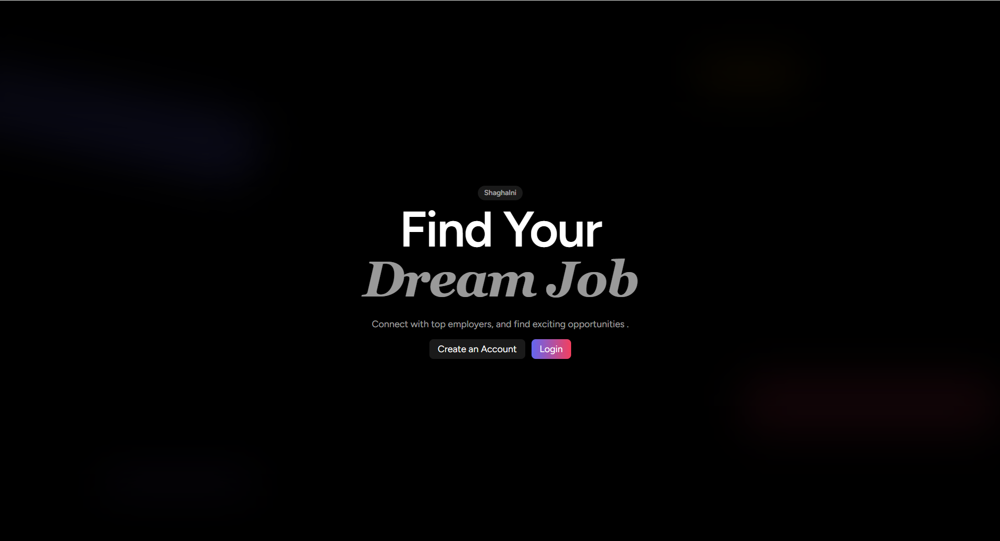
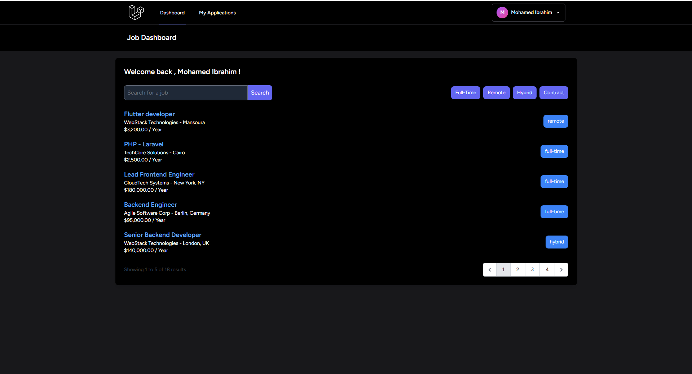
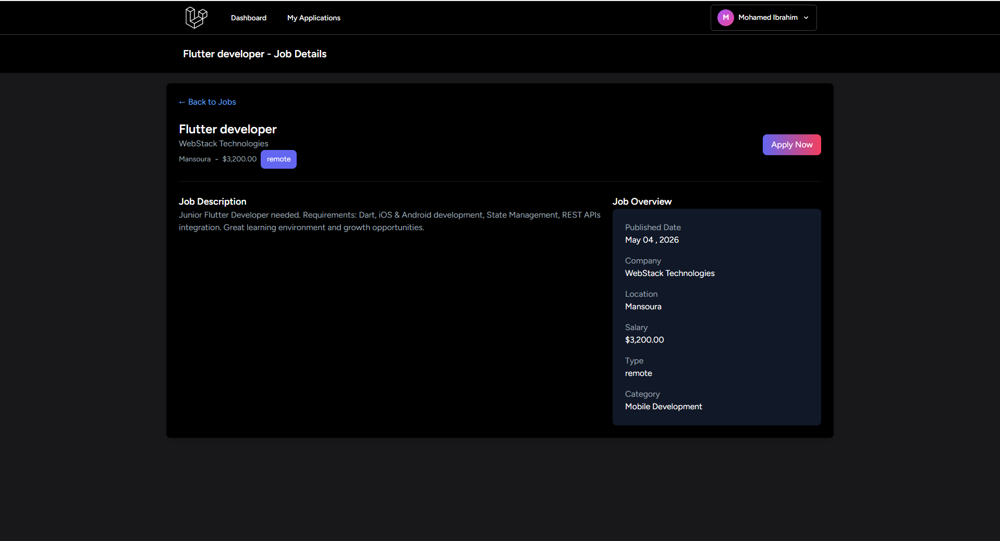
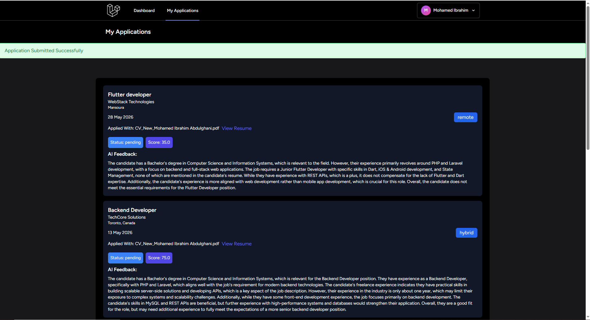

# 💼 Job Matcher (شغلني) - AI-Powered Job Matching Platform

<p align="center">
  
  
  
  
</p>

---

## 📖 نبذة عن المشروع (Project Overview)
**Job Matcher (شغلني)** هي منصة توظيف متكاملة ومبتكرة تعتمد على الـ Dark Mode في تصميمها لتوفير تجربة مستخدم مريحة وعصرية. تهدف المنصة إلى تسهيل عملية البحث عن الوظائف للباحثين عن عمل (Candidates) وإدارة المتقدمين والوظائف لأصحاب الشركات (Employers)، مع دمج تقنيات الذكاء الاصطناعي لتحليل ومطابقة الطلبات وتقييم السير الذاتية وإعطاء تقييم ذكي (AI Scoring & Feedback).

---

## 🎨 النظام التصميمي والهوية البصرية (Design System)

تم بناء واجهات التطبيق بناءً على لوحة ألوان داكنة متباينة (Dark Aesthetic Theme) تعطي طابعاً تكنولوجياً واحترافياً.

### 🔴 لوحة الألوان (Color Palette)

| اللون | كود الـ Hex | الاستخدام في الواجهات |
| :---: | :---: | :--- |
| **الخلفية الأساسية الداكنة** | `#0A0E23` | الخلفية العميقة للصفحات والقوائم لراحة العين وتأثير الوضع الداكن. |
| **اللون البرتقالي الحيوي** | `#F97316` | الأزرار الرئيسية (CTA)، أزرار التقديم، والتفاعلات المهمة (Action Color). |
| **اللون البنفسجي المضيء** | `#6D28D9` | لون النصوص التوضيحية، الأوسمة (Badges)، والتأثيرات الجمالية. |
| **اللون الأزرق اللامع** | `#4F46E5` | الروابط، العناصر النشطة في القوائم، والحدود الجانبية لتركيز الانتباه. |
| **الأحمر التحذيري/التقييم** | `#EF4444` | إشعارات الرفض، الدرجات المنخفضة في الـ AI Score، والأزرار الملغاة. |
| **الأبيض النقي** | `#FFFFFF` | العناوين الرئيسية والنصوص الأساسية لضمان أعلى مستوى من التباين والوضوح. |

### 🔤 الخطوط المستخدمة (Typography)
* **الخط الأساسي للنظام:** `Inter` بالتكامل مع `Cairo` أو `Tajawal` (عبر Google Fonts) لضمان انسيابية تامة وسهولة قراءة النصوص البرمجية والعربية داخل الواجهات الداكنة بدقة فائقة.

---

## 📸 لقطات من داخل المشروع (Screenshots)

> 💡 **ملاحظة:** لظهور هذه الصور بشكل صحيح على حسابك، قم بإنشاء مجلد باسم `screenshots` في المجلد الرئيسي للمشروع على جهازك، وضع الصور بداخله بنفس الأسماء المذكورة أدناه قبل عمل `git push`.

### 1️⃣ الصفحة الرئيسية (Landing Page)
*تتميز بواجهة ترحيبية جذابة مع شريط بحث ذكي للوصول السريع للوظائف.*


### 2️⃣ لوحة التحكم الشاملة (Dashboard)
*توضح إحصائيات الوظائف، الطلبات الحالية، ومتابعة النشاط بشكل منظم.*


### 3️⃣ تفاصيل الوظيفة (Job Details)
*عرض كافة تفاصيل الوظيفة، الشروط، الراتب، مع زر التقديم السريع المتوافق مع لوحة الألوان.*


### 4️⃣ تقييم الذكاء الاصطناعي للطلبات (AI Applications Scoring)
*توضيح نتيجة تحليل الذكاء الاصطناعي للسير الذاتية وإعطاء تقييم نسبي مئوي للمتقدمين لسهولة الفرز.*


---

## 🚀 الميزات الأساسية (Key Features)

* **نظام الصلاحيات والأدوار (Multi-Auth Roles):** فصل كامل بين حساب الباحث عن عمل (لوحة لرفع الـ CV والتقدم) وحساب الشركة (لوحة لإضافة الوظائف وفحص المتقدمين).
* **الفحص الذكي بالذكاء الاصطناعي (AI Application Scoring):** دمج الـ OpenAI API لتقييم مدى ملائمة السيرة الذاتية للمتقدم مع متطلبات الوظيفة وإعطاء Feedback فوري.
* **إدارة الوظائف المتقدمة (Job Management):** لوحة تحكم سلسة لعمل (CRUD Operations) على الوظائف، وتصنيفها حسب نوع الدوام (عن بعد، دوام كامل، جزئي).
* **نظام إشعارات وحالات الطلب:** تحديث فوري لحالة الطلب (قيد المراجعة، مقبول، مرفوض) لتصل للمستخدم مباشرة.

---

## 🛠️ التقنيات المستخدمة (Tech Stack)

* **الـ Backend:** إطار عمل Laravel 10 (PHP)
* **قاعدة البيانات:** MySQL
* **الـ Frontend:** Blade Templates مصممة بالكامل باستخدام Tailwind CSS للتحكم الدقيق بالـ Dark Theme.
* **الذكاء الاصطناعي:** OpenAI API Integration

---

## 💻 طريقة تشغيل المشروع محلياً (Installation Guide)

إذا كنت ترغب في تشغيل المشروع على جهازك الشخصي، يرجى اتباع الخطوات التالية:

1. **تحميل المستودع (Clone):**
   ```bash
   git clone [https://github.com/MohamedIbrahimAbdulghani/job-app.git](https://github.com/MohamedIbrahimAbdulghani/job-app.git)
   cd job-app